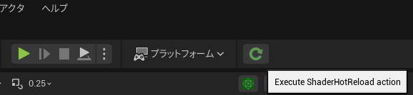

# ShaderHotReload
This plugin enables hot reloading of engine, plugin, and project shaders without restarting the editor, allowing shader changes to be applied instantly and improving iteration efficiency during development.

## Example
[【UE5】エンジンやプラグインのシェーダーをホットリロードしてみた – Unreal Engine 5.6](https://kafues511.jp/2025/09/13/6090/)
