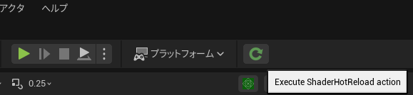

# ShaderHotReload
This plugin enables hot reloading of engine, plugin, and project shaders without restarting the editor, allowing shader changes to be applied instantly and improving iteration efficiency during development.

# Example
[【UE5】シェーダーのホットリロードで開発効率あっぷあっぷ – Unreal Engine 5.6](https://kafues511.jp/2026/03/14/8160/)
